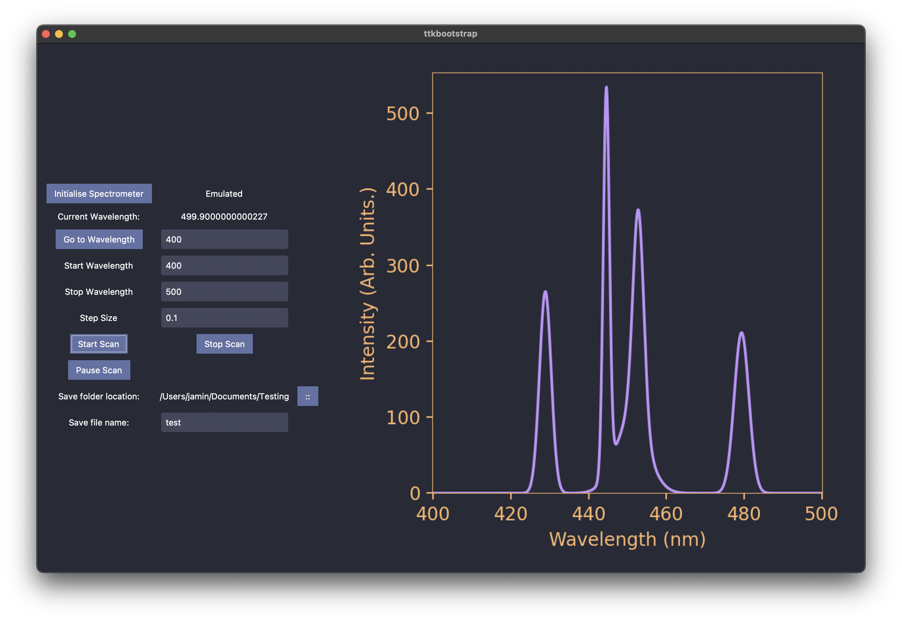

# RECLAS
RECLAS - Rare-Earth Crystal Laser Analysis Suite.

Library for controlling various experimental laser setups for the analysis of rare-earth doped crystals at the University of Canterbury

This is a current and ongoing project porting the experimental rare earth spectroscopy tools we use to Python while maintaining our original LabVIEW interface. 

 

The remaining todo's of this project are pretty straightforward and are as follows:
- Add a drop-down menu to select the desired spectrometer
- Add a drop-down menu for the desired data acquisition device (e.g. oscilloscope/photon counter)
- Add ttkboostrap custom colours injector script. This project relies heavily on the [Dracula colour palette](https://draculatheme.com/). It affords excellent readability/colour contrast in a dark laser lab while sufficiently dark to minimize light pollution. This is not a default colour palette of ttkboostrap, and so a custom script must be written to add it in at installation. 

Instead of adding device-level control for the data acquisition device, these should be set in a config.toml file. This way, the GUI remains simplified, and the acquisition parameters are abstracted away from the GUI and can be set elsewhere specific to that device or if the device supports it, the device itself (which is often easier in my experience). It makes it easy to swap out these devices to a lock-in amplifier, scope, or photon counter on the fly. Instead, the GUI can wait for the data from the specified device regardless of what it is. Specifying a path to these files makes it possible to have your own unique set of configurations that work for your experiment and minimizes previous user presets impacting your experiment. 
