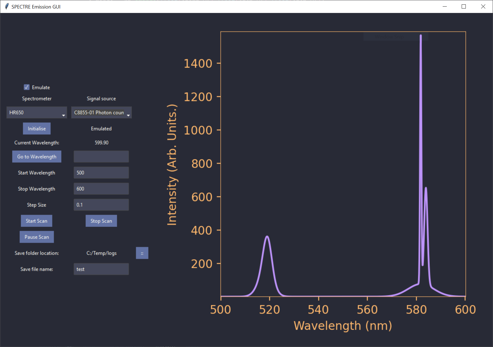

# SPECTRE
SPECTRE - Spectroscopy and Photonics Equipment Control Toolkit for Research and Experimentation.

A Library for controlling various experimental spectroscopy setups at the University of Canterbury. It also contains support tools for the analysis of spectra.

    

This is a current and ongoing project porting the experimental spectroscopy tools we use to Python while maintaining our original LabVIEW interface. 

# Philosophy
 
- All data acquisition devices provide a minimal set of public API's that have crossover such a `measure()` function that returns counts, volts etc for all devices, this makes swapping between devices within the one GUI trivial. Internal API's can function as the device requires them to. This is ideally abstracted away as much as possible (but well documented)

- Instead of adding device-level control for the data acquisition device, these should be set in a `config.toml` file. This way, the GUI remains simplified, and the acquisition parameters are abstracted away from the GUI and can be set elsewhere specific to that device or if the device supports it, the device itself (which is often easier in my experience). It makes it easy to swap out these devices to a lock-in amplifier, scope, or photon counter on the fly. Instead, the GUI can wait for the data from the specified device regardless of what it is. Specifying a path to these files makes it possible to have your own unique set of configurations that work for your experiment and minimises previous user presets impacting your experiment. 

- Where possible device drivers are open sourced and Windows version-specific dependencies are minimised. This is unavoidable, but if it is possible to achieve Windows independent functionality this should be strived for. This will make for more stable programs in the long term. 

# The remaining todo's of this project are pretty straightforward and are as follows:
- ~~Add a drop-down menu to select the desired spectrometer~~
- ~~Add a drop-down menu for the desired data acquisition device (e.g. oscilloscope/photon counter)~~
- ~~Add ttkboostrap custom colours injector script. This project relies heavily on the [Dracula colour palette](https://draculatheme.com/). It affords excellent readability/colour contrast in a dark laser lab while sufficiently dark to minimise light pollution. This is not a default colour palette of ttkboostrap, and so a custom script must be written to add it in at installation.~~
- implement DAQ measure functionality both for the GUI and devices such as photon counter. 
- Produce some examples of configuring DAQ
- Expand documentation 
- Write a guide on adding new equipment
- Where possible, modularise the code for rapid GUI/Control implementation

